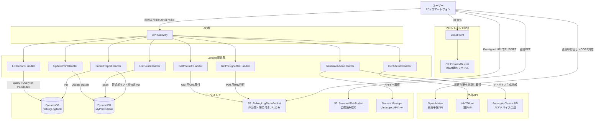

# システム構成図

fishing-log-bot の全体構成です。フロントエンド配信・API・データストア・外部連携APIをすべてAWS CDKでコード管理しています（単一スタック `FishingLogBotStack`）。

## 全体構成図

## コンポーネント一覧

| コンポーネント | 役割 |
| -------------- | ---- |
| CloudFront | フロントエンド（React SPA）の配信。HTTPS化、SPAのルーティング対応（403/404を`index.html`にフォールバック） |
| S3: FrontendBucket | ビルド済みのReact静的ファイルの格納場所。パブリックアクセスは全ブロックし、CloudFrontからのみ読み取り可能（Origin Access Control） |
| API Gateway | フロントエンドからのAPIリクエストの入口（REST API） |
| Lambda | 用途ごとに関数を分割（後述） |
| DynamoDB: FishingLogTable | 釣行レポートの保存先。詳細は[DB設計書](../database/db-design.md)を参照 |
| DynamoDB: MyPointsTable | 釣行ポイントの保存先。詳細は[DB設計書](../database/db-design.md)を参照 |
| S3: FishingLogPhotoBucket | 釣果写真の保存先。パブリックアクセスは全ブロックし、Pre-signed URL経由でのみPUT/GETを許可 |
| S3: SeasonalFishBucket | 「今が旬の魚」情報（JSON・画像）の保存先。公開読み取り専用バケットとして構成 |
| Secrets Manager | Anthropic APIキーを平文でLambdaの環境変数に置かないための保管場所 |

## Lambda関数一覧

| 関数名 | トリガー（エンドポイント） | 役割 |
| ------ | -------------------------- | ---- |
| SubmitReportHandler | `POST /catches` | 釣果レポートを登録。新規ポイントの場合は`MyPointsTable`への登録も同時に行う |
| GetPresignedUrlHandler | `POST /presigned-url` | 釣果写真アップロード用のS3 Pre-signed PUT URLを発行 |
| ListReportsHandler | `GET /catches` | 釣果レポート一覧を取得（ポイント・期間での絞り込みに対応） |
| ListPointsHandler | `GET /points` | 登録済みの釣行ポイント一覧を取得 |
| GetPhotoUrlHandler | `POST /photo-url` | 釣果写真表示用のS3 Pre-signed GET URLを発行 |
| UpdatePointHandler | `PUT /points/{pointId}` | ポイント情報を更新・新規登録（Upsert） |
| GetTideInfoHandler | `GET /tide` | 指定された緯度経度から最寄りの港を計算し、tide736.netから潮汐情報を取得 |
| GenerateAdviceHandler | `POST /advice` | 釣果・天気・潮汐データをもとに、Anthropic Claude APIでAIアドバイスを生成 |

いずれもランタイムは Node.js 20.x（`aws-lambda-nodejs.NodejsFunction`）で統一しています。

## 外部API連携について

| API | 用途 | 呼び出し元 | 選定理由 |
| --- | ---- | ---------- | -------- |
| Open-Meteo | 気温・湿度・風速の取得 | フロントエンドから直接 | APIキー登録不要・無料。|
| tide736.net | 潮汐（満潮・干潮・潮位）の取得 | バックエンド（GetTideInfoHandler）経由 | 緯度経度でなく都道府県コード・港コードでの指定が必要なため、最寄り港の計算をサーバー側で行う必要がある |
| Anthropic Claude API | AIアドバイスの生成 | バックエンド（GenerateAdviceHandler）経由 | APIキーが課金対象の機密情報のため、フロントには一切渡さずSecrets Manager経由でLambda内に閉じ込める |

## セキュリティ上の設計方針

- 各Lambdaには**必要最小限のIAM権限**のみを付与（例：`GetPhotoUrlHandler`にはS3の読み取り権限のみ、`GetPresignedUrlHandler`には書き込み権限のみ）
- 写真バケット（`FishingLogPhotoBucket`）・フロントエンドバケット（`FrontendBucket`）はいずれもパブリックアクセスを完全ブロックし、Pre-signed URLまたはCloudFront（OAC）経由でのみアクセス可能
- Anthropic APIキーはコードやLambdaの環境変数に平文で置かず、AWS Secrets Managerで管理し、実行時に読み取り専用権限で取得

## コストについて

- DynamoDBは`PAY_PER_REQUEST`（オンデマンド）、LambdaもAPI Gatewayも従量課金であり、個人利用規模のアクセス数であれば無料利用枠内〜非常に低コストで収まる構成です
- 外部APIもOpen-Meteo・tide736.netは無料、Anthropic Claude APIもHaikuモデル使用でごく低コストに抑えています
