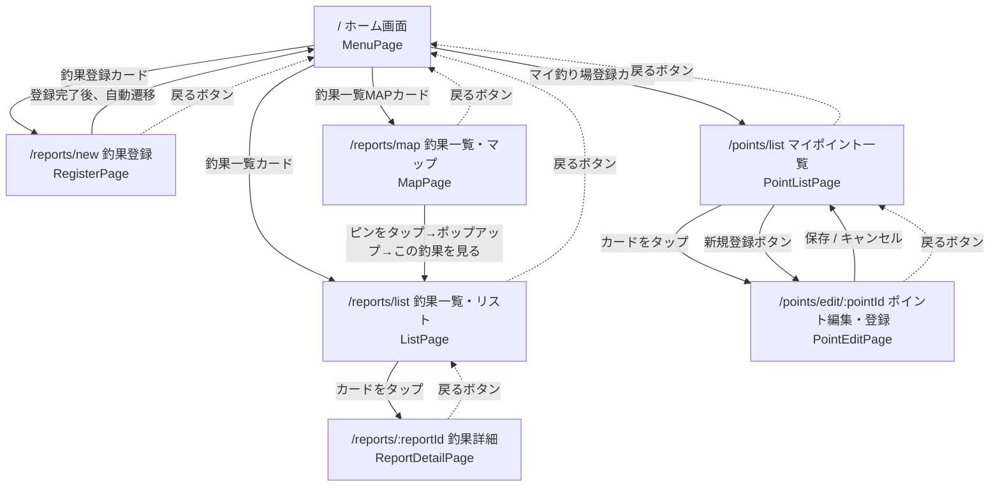

# 画面遷移図

fishing-log-bot の画面構成とルーティング（React Router v7）をまとめたドキュメントです。

## 画面遷移図

実線は明示的な画面遷移（ボタン操作など）、破線は共通ヘッダーの「◀ 戻る」ボタンによる遷移を表しています。

## 画面一覧

| 画面 | パス | コンポーネント | 概要 |
| ---- | ---- | -------------- | ---- |
| ホーム画面 | `/` | `MenuPage` | 総釣果数・登録釣り場数・最大サイズの統計、今が旬の魚情報、各機能へのメニュー |
| 釣果登録 | `/reports/new` | `RegisterPage`（`RegisterFishingReport`） | 釣行時間・写真・釣行ポイント・釣果タイムライン・メモを入力し登録 |
| 釣果一覧・リスト | `/reports/list` | `ListPage`（`FishingReportList`） | 釣行単位のカード一覧。ポイント・期間での絞り込みに対応。`?pointId=`クエリで初期絞り込み可能 |
| 釣果一覧・マップ | `/reports/map` | `MapPage`（`ReportMap`） | OpenStreetMap上に登録済みポイントのピンを表示。ピンタップでポイント名ポップアップ→釣果一覧へ遷移 |
| 釣果詳細 | `/reports/:reportId` | `ReportDetailPage`（`ReportDetail`） | 写真カルーセル、天気・釣行時間、潮汐・風速グラフ、釣果タイムライン、メモ、AIアドバイス |
| マイポイント一覧 | `/points/list` | `PointListPage`（`PointList`） | 登録済みポイントの一覧。緯度経度未登録のポイントには⚠️バッジを表示 |
| ポイント編集・登録 | `/points/edit/:pointId` | `PointEditPage`（`PointEdit`） | ポイント名・説明の編集、地図（住所検索／長押し）による位置情報の登録。`:pointId`が`new`の場合は新規作成 |

## 「戻る」ボタンの挙動について

共通ヘッダー（`PageHeader`）の「◀」ボタンは、原則として**ブラウザの履歴を1つ戻る**動作（`navigate(-1)`）です。ただし、URLを直接開くなど履歴が存在しない場合は、各画面ごとに定義されたフォールバック先（上図の破線の遷移先）に遷移します。これにより、「マップ→一覧」のように複数の経路から遷移してきた場合でも、実際に辿ってきた画面へ正しく戻れるようになっています。